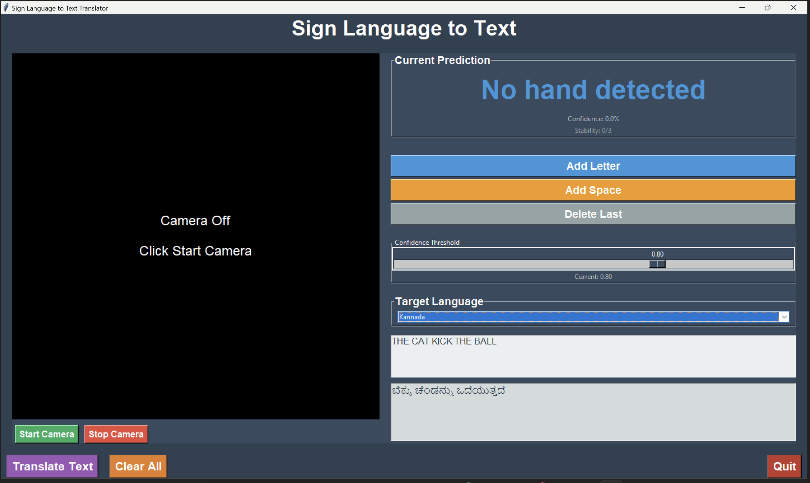

# 🤟 Real-Time ASL to Indian Regional Language Translator

Most sign language translators recognize ASL but output only in English, limiting accessibility. This project builds a real-time ASL recognition system that translates recognized gestures into text across multiple Indian regional languages, promoting inclusivity and language accessibility for diverse users. The application features a graphical user interface (GUI) for ease of use.

-----

## ✨ Features

  * **Real-time ASL Recognition:** Detects and recognizes ASL alphabets from live webcam feed.
  * **Multi-language Translation:** Translates recognized ASL text into several Indian regional languages (Hindi, Tamil, Telugu, Bengali, Marathi, Gujarati, Kannada, Malayalam, Punjabi) and English.
  * **Interactive GUI:** A user-friendly interface to control the camera, view predictions, manage recognized text, and perform translations.
  * **Confidence and Stability Tracking:** Displays prediction confidence and stability to ensure accurate recognition.
  * **Text Management:** Allows adding recognized letters, spaces, and deleting the last character.

-----

## 🚀 Setup and Installation

Follow these steps to get the project up and running on your local machine.

### 📋 Prerequisites

Before you begin, ensure you have the following installed:

  * **Python 3.x:** Download and install Python from [python.org](https://www.python.org/downloads/).
  * **`pip`:** Python's package installer (usually comes with Python).

### 📦 Install Required Libraries

Open your terminal or command prompt and run the following command to install all necessary Python libraries:

```bash
pip install opencv-python numpy tensorflow scikit-learn googletrans==4.0.0-rc1 Pillow
```

### 🧠 Model Files

This project relies on pre-trained TensorFlow models and scikit-learn objects for hand detection and gesture recognition. Ensure the following files are present in your project's root directory:

  * `improved_asl_model.h5` (or `best_model.h5`, `asl_model.h5`)
  * `improved_label_encoder.pkl` (or `label_encoder.pkl`)
  * `feature_scaler.pkl` (optional, but recommended for improved performance)
  * `hand_detection.py`

If any of these files are missing, the application will prompt you with an error. You would typically generate these files by running a model training script (i.e., `model_trainer.py`).

-----

## ▶️ How to Run the Application

To start the ASL Translator application with the graphical user interface:

1.  **Navigate to the project directory:** Open your terminal or command prompt and change your current directory to the `asl_translator` folder:
    ```bash
    cd path/to/your/asl_translator
    ```
2.  **Run the script:** Execute the `complete_asl_app.py` file:
    ```bash
    python complete_asl_app.py
    ```
3.  **Camera Index:** The application might ask you for a camera index (e.g., `0` for the default webcam, `1` for an external one). Enter the appropriate number and press Enter.

-----

## 🎮 Usage and Controls

Once the application window appears, here's how to interact with it:

### GUI Controls:

  * **Start Camera:** Click this button to activate your webcam feed.
  * **Stop Camera:** Click this button to stop the webcam feed.
  * **Add Letter:** Adds the currently predicted stable ASL letter to the "Recognized Text" area.
  * **Add Space:** Adds a space character to the "Recognized Text" area.
  * **Delete Last:** Removes the last character from the "Recognized Text" area.
  * **Confidence Threshold (Slider):** Adjusts the minimum confidence level required for a prediction to be considered stable. Higher values mean stricter recognition.
  * **Target Language (Dropdown):** Select the language you want the recognized text to be translated into.
  * **Translate Text:** Click this button to translate the content in the "Recognized Text" area to the selected target language.
  * **Clear All:** Clears both the "Recognized Text" and "Translated Text" areas.
  * **Quit:** Closes the application.

-----

## 📸 Screenshots

Here are some screenshots illustrating the application's interface and functionality:




-----